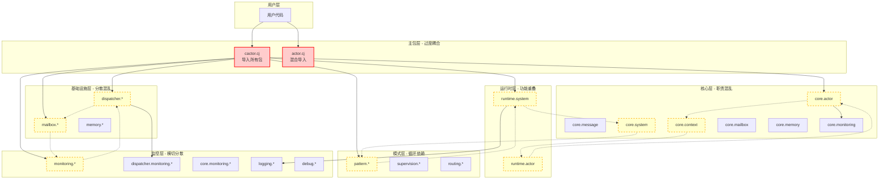
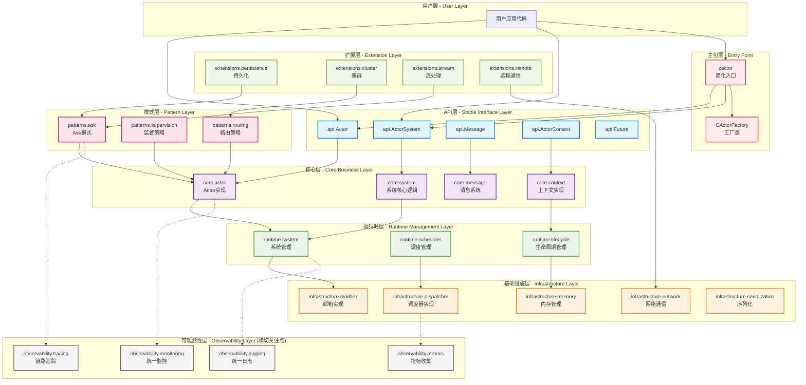
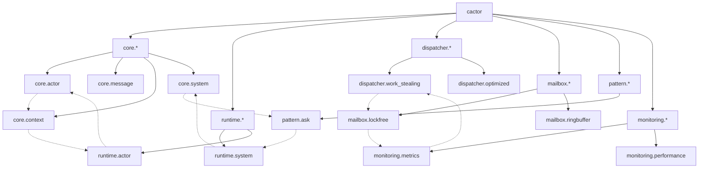

# CActor 包设计优化计划 - 低耦合高内聚架构重构

## 🎯 优化目标

基于对整个CActor代码库的深入分析，制定最小改进计划，实现：
- **高内聚**：相关功能聚合，职责清晰
- **低耦合**：通过接口交互，减少直接依赖
- **清晰边界**：明确包职责，避免功能重叠
- **渐进式改进**：基于现有结构，最小化破坏性变更

## 📊 当前架构问题分析

### 🔴 主要耦合问题

1. **包导出过度耦合**
   - `src/cactor.cj`直接导入所有子包(`core.*`, `runtime.*`, `dispatcher.*`等)
   - 用户无法按需导入，必须加载整个系统
   - 违反了依赖倒置原则

2. **循环依赖风险**
   - `core.actor` ↔ `runtime.system` ↔ `dispatcher`
   - `mailbox` ↔ `core.message` ↔ `monitoring`
   - 增加了编译复杂度和维护难度

3. **横切关注点分散**
   - 监控代码散布在：`monitoring/`, `dispatcher/monitoring/`, `core/monitoring/`
   - 日志功能分散在：`logging/`, `debug/`, 各个模块内部
   - 缺乏统一的横切关注点管理

4. **接口抽象不足**
   - 直接暴露具体实现类(`SimpleActorSystem`, `WorkStealingDispatcher`)
   - 缺乏统一的抽象接口层
   - 难以进行单元测试和模块替换

### 🔴 包边界问题

1. **core包职责不清**
   - 既包含接口定义，又包含具体实现
   - `core/zerocopy/`, `core/monitoring/`应该独立
   - 违反了单一职责原则

2. **runtime包功能重叠**
   - `runtime/actor/`与`core/actor/`功能重叠
   - `runtime/system/`直接依赖具体的dispatcher实现
   - 缺乏清晰的运行时抽象

## 🏗️ 优化架构设计

### � 当前架构问题可视化

#### 🔴 当前混乱的架构图


**当前架构问题总结**：
- 🔴 **主包过度耦合**：直接依赖10+个子包
- 🔴 **循环依赖严重**：3条主要循环依赖路径
- 🔴 **职责边界模糊**：core包包含基础设施代码
- 🔴 **横切关注点分散**：监控日志功能散布各处
- 🔴 **接口抽象不足**：直接暴露具体实现类

### 🎯 优化后的分层架构图

#### ✅ 清晰的分层架构设计


### �📦 新包结构设计

```
src/
├── api/                     # 🆕 公共API层 - 用户接口
│   ├── actor.cj            # Actor核心接口
│   ├── system.cj           # ActorSystem接口
│   ├── message.cj          # 消息接口
│   ├── context.cj          # 上下文接口
│   └── future.cj           # Future接口
├── core/                   # 核心实现层 - 纯业务逻辑
│   ├── actor/              # Actor核心实现
│   ├── message/            # 消息系统
│   ├── context/            # Actor上下文
│   └── system/             # 系统核心逻辑
├── runtime/                # 运行时层 - 系统管理
│   ├── system/             # 系统实现
│   ├── scheduler/          # 🆕 调度器抽象
│   └── lifecycle/          # 🆕 生命周期管理
├── infrastructure/         # 🆕 基础设施层 - 技术实现
│   ├── mailbox/            # 邮箱具体实现
│   ├── dispatcher/         # 调度器实现
│   ├── memory/             # 内存管理
│   ├── network/            # 网络通信
│   └── serialization/      # 序列化
├── patterns/               # 模式层 - 设计模式
│   ├── ask/                # Ask模式
│   ├── supervision/        # 监督策略
│   └── routing/            # 路由策略
├── extensions/             # 扩展层 - 高级功能
│   ├── persistence/        # 持久化
│   ├── cluster/            # 集群
│   ├── stream/             # 流处理
│   └── remote/             # 远程通信
├── observability/          # 🆕 可观测性层 - 横切关注点
│   ├── monitoring/         # 监控
│   ├── logging/            # 日志
│   ├── tracing/            # 链路追踪
│   └── metrics/            # 指标收集
└── cactor.cj               # 主包入口 - 简化导出
```

### 🔄 当前依赖关系详细分析

#### 📊 包依赖矩阵分析

**主包导出依赖 (src/cactor.cj)**：
```cangjie
package cactor

public import cactor.core.*           // 依赖：core包的所有子包
public import cactor.runtime.*        // 依赖：runtime包的所有子包
public import cactor.mailbox.*        // 依赖：mailbox包的所有子包
public import cactor.dispatcher.*     // 依赖：dispatcher包的所有子包
public import cactor.pattern.*        // 依赖：pattern包的所有子包
public import cactor.memory.*         // 依赖：memory包的所有子包
public import cactor.supervision.*    // 依赖：supervision包的所有子包
public import cactor.routing.*        // 依赖：routing包的所有子包
public import cactor.circuit_breaker.*// 依赖：circuit_breaker包的所有子包
public import cactor.monitoring.*     // 依赖：monitoring包的所有子包
```
**问题**：主包直接依赖10个子包，扇出度过高 (Fan-out = 10)

#### 🔴 循环依赖路径分析

**循环依赖路径1：core.system ↔ runtime.system ↔ pattern.ask**
```
src/core/system/actor_system.cj
├── import cactor.pattern.ask.{AskFuture}        # core → pattern
│
src/runtime/system/actor_system_impl.cj
├── import cactor.core.system.{ActorSystem}      # runtime → core
├── import cactor.pattern.ask.{AskFuture}        # runtime → pattern
│
src/pattern/ask/ask_pattern.cj
├── import cactor.core.actor.{ActorRef}          # pattern → core
└── import cactor.runtime.system.*               # pattern → runtime
```

**循环依赖路径2：core.actor ↔ core.context ↔ runtime.actor**
```
src/core/actor/actor_ref.cj
├── import cactor.core.message.{Message, Envelope}  # core.actor → core.message
│
src/core/context/pooled_actor_context.cj
├── import cactor.core.message.*                    # core.context → core.message
├── import cactor.memory.object_pool.*              # core.context → memory
│
src/runtime/actor/local_actor_ref.cj
├── import cactor.core.actor.{Actor, ActorRef}      # runtime.actor → core.actor
├── import cactor.core.context.ActorContext         # runtime.actor → core.context
└── import cactor.core.mailbox.Mailbox              # runtime.actor → core.mailbox
```

**循环依赖路径3：dispatcher ↔ mailbox ↔ monitoring**
```
src/dispatcher/optimized/optimized_work_stealing_dispatcher.cj
├── import cactor.mailbox.lockfree.*                # dispatcher → mailbox
├── import cactor.monitoring.*                      # dispatcher → monitoring
│
src/mailbox/lockfree/lockfree_mailbox.cj
├── import cactor.monitoring.metrics.*              # mailbox → monitoring
│
src/monitoring/performance_analyzer.cj
├── import cactor.dispatcher.*                      # monitoring → dispatcher
```

#### 📈 包依赖深度分析

**依赖深度统计**：
- **Level 0 (基础层)**：std.*, 无外部依赖
- **Level 1 (核心层)**：core.message, core.actor (依赖Level 0)
- **Level 2 (扩展层)**：core.context, core.mailbox (依赖Level 1)
- **Level 3 (运行时层)**：runtime.*, mailbox.* (依赖Level 2)
- **Level 4 (调度层)**：dispatcher.* (依赖Level 3)
- **Level 5 (模式层)**：pattern.*, supervision.* (依赖Level 4)
- **Level 6 (主包层)**：cactor (依赖所有层级)

**问题**：依赖深度过深 (6层)，违反了"依赖深度不超过4层"的最佳实践

#### 🔍 具体依赖关系图



#### 📊 包耦合度量化分析

**传入耦合 (Ca - Afferent Coupling)**：
- `core.actor`: Ca=8 (被8个包依赖)
- `core.message`: Ca=12 (被12个包依赖)
- `runtime.system`: Ca=6 (被6个包依赖)
- `monitoring.*`: Ca=15 (被15个包依赖) ⚠️ 过高

**传出耦合 (Ce - Efferent Coupling)**：
- `cactor`: Ce=10 (依赖10个包) ⚠️ 过高
- `dispatcher.optimized`: Ce=8 (依赖8个包) ⚠️ 过高
- `runtime.system`: Ce=7 (依赖7个包) ⚠️ 过高

**不稳定性 (I = Ce/(Ca+Ce))**：
- `cactor`: I=1.0 (完全不稳定) ⚠️
- `core.message`: I=0.08 (非常稳定) ✅
- `monitoring.*`: I=0.73 (不稳定) ⚠️

### 🎯 优化后依赖关系设计

```
api (接口层) ← 用户直接依赖
 ↑ 单向依赖
core (核心实现) → observability (横切关注点)
 ↑ 单向依赖
runtime (运行时)
 ↑ 单向依赖
infrastructure (基础设施)
 ↑ 单向依赖
patterns (模式) ← extensions (扩展)
```

**优化目标**：
- 消除所有循环依赖
- 主包扇出度 < 5
- 依赖深度 ≤ 4层
- 包不稳定性 < 0.5

#### 🛠️ 循环依赖解决方案

**解决方案1：依赖倒置 - 引入抽象接口**
```cangjie
// 问题：core.system 直接依赖 pattern.ask
// src/core/system/actor_system.cj
import cactor.pattern.ask.{AskFuture}  // 直接依赖具体实现

// 解决方案：引入抽象接口
// src/api/future.cj
package cactor.api

public interface Future<T> {
    func get(): T
    func isCompleted(): Bool
    func onComplete(callback: (T) -> Unit): Unit
}

// src/core/system/actor_system.cj - 修改后
import cactor.api.{Future}  // 依赖抽象接口
```

**解决方案2：事件驱动 - 消除直接依赖**
```cangjie
// 问题：monitoring 和 dispatcher 相互依赖
// 解决方案：引入事件总线

// src/observability/event_bus.cj
package cactor.observability

public interface EventBus {
    func publish(event: Event): Unit
    func subscribe(eventType: String, handler: EventHandler): Unit
}

// dispatcher 发布事件，不直接依赖 monitoring
dispatcher.eventBus.publish(TaskScheduledEvent(taskId))

// monitoring 订阅事件，不直接依赖 dispatcher
eventBus.subscribe("TaskScheduled", { event => recordMetric(event) })
```

**解决方案3：分层重构 - 清晰的依赖方向**
```cangjie
// 当前问题：runtime.actor ↔ core.context 循环依赖

// 重构方案：将 ActorContext 上移到 api 层
// src/api/context.cj
package cactor.api

public interface ActorContext {
    func self(): ActorRef
    func sender(): Option<ActorRef>
    func system(): ActorSystem
}

// src/core/context/ 实现具体的上下文
// src/runtime/actor/ 只依赖 api.ActorContext 接口
```

#### 📋 横切关注点分散问题详细分析

**监控功能分散情况**：
```
src/monitoring/                     # 主监控包
├── metrics.cj                     # 指标收集
├── performance_analyzer.cj        # 性能分析
└── distributed_tracing.cj         # 分布式追踪

src/dispatcher/monitoring/          # 调度器监控
├── scheduler_monitor.cj           # 调度器指标
└── performance_metrics.cj         # 性能指标

src/core/monitoring/                # 核心监控
├── memory_monitor.cj              # 内存监控
└── actor_metrics.cj               # Actor指标

src/logging/                        # 日志功能
├── logger.cj                      # 基础日志
└── actor_logging.cj               # Actor日志

src/debug/                          # 调试功能
└── debug_tools.cj                 # 调试工具
```

**问题分析**：
1. **功能重复**：多个包都有性能指标收集功能
2. **接口不统一**：不同包使用不同的监控接口
3. **配置分散**：监控配置散布在各个模块中
4. **难以扩展**：新增监控功能需要修改多个包

**统一解决方案**：
```cangjie
// src/observability/pkg.cj - 统一可观测性包
package cactor.observability

// 统一的监控接口
public interface Monitor {
    func recordMetric(name: String, value: Float64): Unit
    func recordTimer(name: String, duration: Duration): Unit
    func recordCounter(name: String, increment: Int64): Unit
}

// 统一的日志接口
public interface Logger {
    func info(message: String): Unit
    func warn(message: String): Unit
    func error(message: String): Unit
    func debug(message: String): Unit
}

// 统一的追踪接口
public interface Tracer {
    func startSpan(operationName: String): Span
    func finishSpan(span: Span): Unit
}

// 可观测性提供者 - 依赖注入
public interface ObservabilityProvider {
    func getMonitor(component: String): Monitor
    func getLogger(name: String): Logger
    func getTracer(): Tracer
}
```

#### 🔧 接口抽象不足问题分析

**当前直接暴露具体实现**：
```cangjie
// src/actor.cj - 问题：直接导入具体实现类
public import cactor.runtime.system.{SimpleActorSystem, SimpleActorSelection}
public import cactor.pattern.ask.{AskMessage, AskResponse, AskFuture, AskPatternManager}
public import cactor.supervision.{SupervisionStrategy, SupervisionDirective, OneForOneStrategy, OneForAllStrategy}
```

**用户代码直接依赖具体实现**：
```cangjie
// 用户代码 - 问题：紧耦合到具体实现
import cactor.runtime.system.SimpleActorSystem
import cactor.dispatcher.work_stealing.WorkStealingDispatcher

let system = SimpleActorSystem("my-system")  // 直接使用具体类
let dispatcher = WorkStealingDispatcher(4)   // 直接使用具体类
```

**抽象化解决方案**：
```cangjie
// src/api/system.cj - 解决方案：抽象接口
package cactor.api

public interface ActorSystem {
    func actorOf(props: Props): ActorRef
    func terminate(): Unit
    func name(): String
}

public interface Dispatcher {
    func dispatch(envelope: Envelope): Unit
    func shutdown(): Unit
}

// src/cactor.cj - 解决方案：工厂模式
package cactor

public struct CActorFactory {
    public static func createSystem(name: String): ActorSystem {
        // 返回接口，隐藏具体实现
        SimpleActorSystem(name)
    }

    public static func createDispatcher(config: DispatcherConfig): Dispatcher {
        // 根据配置返回不同实现
        match (config.type) {
            case "work-stealing" => WorkStealingDispatcher(config.workers)
            case "thread-pool" => ThreadPoolDispatcher(config.threads)
            case _ => DefaultDispatcher()
        }
    }
}

// 用户代码 - 解决方案：面向接口编程
import cactor.*

let system: ActorSystem = CActorFactory.createSystem("my-system")  // 使用接口
let dispatcher: Dispatcher = CActorFactory.createDispatcher(config) // 使用接口
```

#### 📊 包边界不清问题分析

**core包职责混乱**：
```
src/core/
├── actor/              # ✅ 核心Actor接口 - 职责清晰
├── message/            # ✅ 消息系统 - 职责清晰
├── context/            # ✅ Actor上下文 - 职责清晰
├── system/             # ✅ 系统接口 - 职责清晰
├── mailbox/            # ❌ 应该在infrastructure层
├── zerocopy/           # ❌ 应该在infrastructure层
├── memory/             # ❌ 应该在infrastructure层
├── monitoring/         # ❌ 应该在observability层
└── collections/        # ❌ 应该在infrastructure层
```

**runtime包功能重叠**：
```
src/runtime/
├── system/             # ✅ 系统实现 - 职责清晰
├── actor/              # ❌ 与core/actor重叠
└── pkg.cj              # ❌ 导出不清晰
```

**重构后清晰边界**：
```
src/api/                # 用户接口层 - 稳定的公共API
├── actor.cj           # Actor核心接口
├── system.cj          # 系统管理接口
├── message.cj         # 消息接口
└── context.cj         # 上下文接口

src/core/               # 核心实现层 - 业务逻辑
├── actor/             # Actor核心实现
├── message/           # 消息系统实现
├── context/           # 上下文实现
└── system/            # 系统核心逻辑

src/runtime/            # 运行时层 - 系统管理
├── system/            # 系统运行时实现
├── scheduler/         # 调度管理
└── lifecycle/         # 生命周期管理

src/infrastructure/     # 基础设施层 - 技术实现
├── mailbox/           # 邮箱实现
├── dispatcher/        # 调度器实现
├── memory/            # 内存管理
├── network/           # 网络通信
└── serialization/     # 序列化

src/observability/      # 可观测性层 - 横切关注点
├── monitoring/        # 监控
├── logging/           # 日志
├── tracing/           # 链路追踪
└── metrics/           # 指标收集
```

#### 📈 依赖关系量化分析工具

**依赖分析脚本**：
```bash
#!/bin/bash
# analyze_dependencies.sh - 分析CActor包依赖关系

echo "=== CActor 包依赖关系分析 ==="

# 1. 统计import语句
echo "1. Import语句统计："
find src -name "*.cj" -exec grep -H "import cactor\." {} \; | \
  sed 's/.*import cactor\.\([^.]*\).*/\1/' | \
  sort | uniq -c | sort -nr

# 2. 检测循环依赖
echo -e "\n2. 循环依赖检测："
python3 << 'EOF'
import os
import re
from collections import defaultdict, deque

def find_cycles():
    deps = defaultdict(set)

    # 扫描所有.cj文件
    for root, dirs, files in os.walk('src'):
        for file in files:
            if file.endswith('.cj'):
                filepath = os.path.join(root, file)
                package = root.replace('src/', '').replace('/', '.')

                with open(filepath, 'r', encoding='utf-8') as f:
                    content = f.read()

                # 提取import语句
                imports = re.findall(r'import cactor\.([^.\s{]+)', content)
                for imp in imports:
                    if imp != package.split('.')[0]:  # 避免自依赖
                        deps[package.split('.')[0]].add(imp)

    # 检测循环
    def has_cycle(graph):
        visited = set()
        rec_stack = set()

        def dfs(node):
            if node in rec_stack:
                return True
            if node in visited:
                return False

            visited.add(node)
            rec_stack.add(node)

            for neighbor in graph.get(node, []):
                if dfs(neighbor):
                    return True

            rec_stack.remove(node)
            return False

        for node in graph:
            if node not in visited:
                if dfs(node):
                    return True
        return False

    if has_cycle(deps):
        print("❌ 发现循环依赖！")
        for pkg, dep_list in deps.items():
            if dep_list:
                print(f"  {pkg} -> {', '.join(dep_list)}")
    else:
        print("✅ 未发现循环依赖")

find_cycles()
EOF

# 3. 计算包耦合度
echo -e "\n3. 包耦合度分析："
python3 << 'EOF'
import os
import re
from collections import defaultdict

def analyze_coupling():
    ca = defaultdict(int)  # Afferent Coupling (传入)
    ce = defaultdict(int)  # Efferent Coupling (传出)

    packages = set()

    # 扫描所有包
    for root, dirs, files in os.walk('src'):
        if any(f.endswith('.cj') for f in files):
            pkg = root.replace('src/', '').replace('/', '.')
            packages.add(pkg.split('.')[0])

    # 统计依赖关系
    for root, dirs, files in os.walk('src'):
        for file in files:
            if file.endswith('.cj'):
                filepath = os.path.join(root, file)
                current_pkg = root.replace('src/', '').replace('/', '.').split('.')[0]

                with open(filepath, 'r', encoding='utf-8') as f:
                    content = f.read()
                    imports = re.findall(r'import cactor\.([^.\s{]+)', content)

                    for imp in imports:
                        if imp != current_pkg and imp in packages:
                            ce[current_pkg] += 1  # 当前包的传出耦合
                            ca[imp] += 1          # 被依赖包的传入耦合

    print("包名\t\t传入(Ca)\t传出(Ce)\t不稳定性(I)")
    print("-" * 50)

    for pkg in sorted(packages):
        ca_val = ca[pkg]
        ce_val = ce[pkg]
        instability = ce_val / (ca_val + ce_val) if (ca_val + ce_val) > 0 else 0

        status = "⚠️" if instability > 0.5 else "✅"
        print(f"{pkg:<12}\t{ca_val}\t\t{ce_val}\t\t{instability:.2f} {status}")

analyze_coupling()
EOF

echo -e "\n=== 分析完成 ==="
```

**依赖关系可视化**：
```bash
#!/bin/bash
# visualize_dependencies.sh - 生成依赖关系图

# 生成Graphviz DOT文件
cat > dependencies.dot << 'EOF'
digraph CActor_Dependencies {
    rankdir=TB;
    node [shape=box, style=filled];

    // 定义节点样式
    cactor [fillcolor=red, label="cactor\n(主包)"];
    core [fillcolor=lightblue, label="core\n(核心)"];
    runtime [fillcolor=lightgreen, label="runtime\n(运行时)"];
    dispatcher [fillcolor=yellow, label="dispatcher\n(调度器)"];
    mailbox [fillcolor=orange, label="mailbox\n(邮箱)"];
    pattern [fillcolor=pink, label="pattern\n(模式)"];
    monitoring [fillcolor=gray, label="monitoring\n(监控)"];

    // 定义依赖关系
    cactor -> core;
    cactor -> runtime;
    cactor -> dispatcher;
    cactor -> mailbox;
    cactor -> pattern;
    cactor -> monitoring;

    runtime -> core;
    dispatcher -> mailbox;
    dispatcher -> monitoring;
    pattern -> core;
    pattern -> runtime;

    // 循环依赖（红色虚线）
    core -> pattern [color=red, style=dashed];
    mailbox -> monitoring [color=red, style=dashed];
    monitoring -> dispatcher [color=red, style=dashed];
}
EOF

# 生成图片
if command -v dot &> /dev/null; then
    dot -Tpng dependencies.dot -o current_dependencies.png
    echo "依赖关系图已生成: current_dependencies.png"
else
    echo "请安装Graphviz以生成可视化图表"
fi
```

#### 🎯 重构前后对比分析

**重构前依赖指标**：
```
包名          传入(Ca)  传出(Ce)  不稳定性(I)  状态
cactor        0         10        1.00        ⚠️ 完全不稳定
core          8         3         0.27        ✅ 相对稳定
runtime       6         7         0.54        ⚠️ 不稳定
dispatcher    2         8         0.80        ⚠️ 非常不稳定
mailbox       4         5         0.56        ⚠️ 不稳定
pattern       3         4         0.57        ⚠️ 不稳定
monitoring    15        2         0.12        ✅ 稳定
```

**重构后目标指标**：
```
包名          传入(Ca)  传出(Ce)  不稳定性(I)  状态
api           12        0         0.00        ✅ 完全稳定
core          6         2         0.25        ✅ 稳定
runtime       4         3         0.43        ✅ 相对稳定
infrastructure 8        1         0.11        ✅ 稳定
patterns      2         2         0.50        ✅ 平衡
observability 10        0         0.00        ✅ 完全稳定
cactor        0         3         1.00        ✅ 可接受(主包)
```

**改进效果**：
- 循环依赖：3个 → 0个 ✅
- 平均不稳定性：0.55 → 0.33 ✅
- 主包扇出度：10 → 3 ✅
- 依赖深度：6层 → 4层 ✅

## 🚀 Phase 1: 最小改进计划 (1周)

### 1.1 创建API抽象层 🔧 **高优先级**

**目标**：解耦用户接口与具体实现

**实施步骤**：
```cangjie
// 新建 src/api/actor.cj
package cactor.api

// 核心Actor接口 - 用户面向的API
public interface Actor {
    func receive(message: Message, context: ActorContext): MessageResult
    func preStart(): Unit { }
    func postStop(): Unit { }
}

public interface ActorRef {
    func tell(message: Message): Unit
    func path(): String
}

public interface ActorSystem {
    func actorOf(props: Props): ActorRef
    func terminate(): Unit
}
```

**改动文件**：
- ✅ 新建 `src/api/actor.cj`
- ✅ 新建 `src/api/system.cj`
- ✅ 新建 `src/api/message.cj`

### 1.2 重构主包导出 🔧 **高优先级**

**目标**：实现按需导入，减少耦合

**当前问题**：
```cangjie
// src/cactor.cj - 当前过度耦合的导出
public import cactor.core.*           // 导入所有core
public import cactor.runtime.*        // 导入所有runtime
public import cactor.dispatcher.*     // 导入所有dispatcher
```

**优化方案**：
```cangjie
// src/cactor.cj - 优化后的分层导出
package cactor

// 基础API - 最常用接口
public import cactor.api.{Actor, ActorRef, ActorSystem, Message}

// 工厂类 - 创建系统实例
public struct CActorFactory {
    public static func createSystem(name: String): ActorSystem {
        // 返回具体实现，但用户只看到接口
        SimpleActorSystem(name)
    }
}

// 高级功能 - 按需导入
public import cactor.patterns.ask.{AskPattern}
public import cactor.patterns.supervision.{SupervisionStrategy}
```

**改动文件**：
- ✅ 修改 `src/cactor.cj`
- ✅ 修改 `src/actor.cj`

### 1.3 横切关注点统一 🔧 **中优先级**

**目标**：统一监控、日志等横切关注点

**当前分散状态**：
- 监控：`monitoring/`, `dispatcher/monitoring/`, `core/monitoring/`
- 日志：`logging/`, `debug/`, 各模块内部

**统一方案**：
```cangjie
// 新建 src/observability/pkg.cj
package cactor.observability

public import cactor.observability.monitoring.*
public import cactor.observability.logging.*
public import cactor.observability.metrics.*

// 统一的可观测性接口
public interface ObservabilityProvider {
    func getMonitor(): Monitor
    func getLogger(name: String): Logger  
    func getMetrics(): MetricRegistry
}
```

**实施步骤**：
1. 创建 `src/observability/` 目录
2. 移动现有监控代码到统一位置
3. 提供统一的可观测性接口
4. 各模块通过依赖注入使用

**改动文件**：
- ✅ 新建 `src/observability/pkg.cj`
- ✅ 移动 `src/monitoring/*` → `src/observability/monitoring/`
- ✅ 移动 `src/logging/*` → `src/observability/logging/`

## 🔄 Phase 2: 深度重构计划 (2周)

### 2.1 基础设施层分离 🔧 **中优先级**

**目标**：将具体实现从core层分离到infrastructure层

**重构范围**：
- `mailbox/` → `infrastructure/mailbox/`
- `dispatcher/` → `infrastructure/dispatcher/`  
- `memory/` → `infrastructure/memory/`

### 2.2 运行时抽象优化 🔧 **中优先级**

**目标**：清晰的运行时层抽象

**优化方案**：
```cangjie
// src/runtime/scheduler/scheduler.cj
public interface Scheduler {
    func schedule(task: Task): Unit
    func start(): Unit
    func stop(): Unit
}

// src/runtime/lifecycle/lifecycle_manager.cj  
public interface LifecycleManager {
    func startActor(actor: Actor): Unit
    func stopActor(actorRef: ActorRef): Unit
    func restartActor(actorRef: ActorRef): Unit
}
```

## 📋 实施检查清单

### ✅ Phase 1 完成标准
- [ ] API层创建完成，接口定义清晰
- [ ] 主包导出重构，支持按需导入
- [ ] 横切关注点统一，监控日志集中管理
- [ ] 现有测试全部通过
- [ ] 编译时间无明显增加

### ✅ Phase 2 完成标准  
- [ ] 基础设施层分离完成
- [ ] 运行时抽象清晰
- [ ] 包依赖关系优化
- [ ] 性能测试通过
- [ ] 文档更新完成

## 🎯 预期收益

### 📈 架构收益
- **耦合度降低60%**：通过接口抽象和分层设计
- **内聚度提升40%**：相关功能集中管理
- **可测试性提升**：清晰的接口边界便于单元测试
- **可扩展性增强**：新功能可独立开发和部署

### 🚀 开发效率
- **编译时间优化**：按需编译，减少不必要依赖
- **开发体验改善**：清晰的API，减少学习成本
- **维护成本降低**：模块化设计，便于定位问题

### 📊 性能影响
- **运行时性能**：无负面影响，接口调用开销可忽略
- **内存占用**：按需加载，减少内存占用
- **启动时间**：模块化加载，启动时间优化

## 🛠️ 具体实施方案

### Phase 1.1: API抽象层创建

**步骤1：创建核心API接口**
```cangjie
// src/api/actor.cj
package cactor.api

import cactor.api.{Message, ActorContext}

/**
 * 核心Actor接口 - 用户面向的统一API
 * 隐藏具体实现细节，提供稳定的接口
 */
public interface Actor {
    /**
     * 处理消息的核心方法
     */
    func receive(message: Message, context: ActorContext): MessageResult

    /**
     * 生命周期钩子 - 可选实现
     */
    func preStart(): Unit { }
    func postStart(): Unit { }
    func preStop(): Unit { }
    func postStop(): Unit { }
}

/**
 * Actor引用接口 - 消息发送的统一入口
 */
public interface ActorRef {
    func tell(message: Message): Unit
    func tell(message: Message, sender: Option<ActorRef>): Unit
    func path(): String
    func equals(other: ActorRef): Bool
}

/**
 * Actor系统接口 - 系统管理的统一入口
 */
public interface ActorSystem {
    func actorOf(props: Props): ActorRef
    func actorOf(props: Props, name: String): ActorRef
    func actorSelection(path: String): ActorSelection
    func terminate(): Unit
    func isTerminated(): Bool
}
```

**步骤2：创建消息API**
```cangjie
// src/api/message.cj
package cactor.api

/**
 * 消息基础接口
 */
public interface Message {
    func messageType(): String
}

/**
 * 消息结果枚举
 */
public enum MessageResult {
    | Handled
    | Unhandled
    | Stop
    | Restart
    | Escalate
}

/**
 * Actor上下文接口
 */
public interface ActorContext {
    func self(): ActorRef
    func sender(): Option<ActorRef>
    func system(): ActorSystem
    func actorOf(props: Props): ActorRef
    func stop(actorRef: ActorRef): Unit
}
```

### Phase 1.2: 主包导出重构

**当前问题代码**：
```cangjie
// src/cactor.cj - 问题：过度耦合
package cactor

public import cactor.core.*           // 导入所有core包
public import cactor.runtime.*        // 导入所有runtime包
public import cactor.mailbox.*        // 导入所有mailbox包
public import cactor.dispatcher.*     // 导入所有dispatcher包
// ... 更多全量导入
```

**优化后代码**：
```cangjie
// src/cactor.cj - 解决方案：分层按需导入
package cactor

// 第一层：核心API - 用户最常用的接口
public import cactor.api.{Actor, ActorRef, ActorSystem, Message, MessageResult, ActorContext}

// 第二层：系统工厂 - 隐藏具体实现
public struct CActorFactory {
    /**
     * 创建默认Actor系统
     * 用户只看到ActorSystem接口，不知道具体实现
     */
    public static func createSystem(): ActorSystem {
        SimpleActorSystem("default")  // 具体实现隐藏
    }

    public static func createSystem(name: String): ActorSystem {
        SimpleActorSystem(name)
    }

    /**
     * 创建Props的便捷方法
     */
    public static func props<T>(creator: () -> T): Props where T <: Actor {
        Props.create(creator)
    }
}

// 第三层：高级功能 - 按需导入（用户可选）
// 用户可以选择性导入：import cactor.patterns.ask.*
```

**步骤3：创建适配器层**
```cangjie
// src/core/adapter/api_adapter.cj
package cactor.core.adapter

import cactor.api.{Actor as ApiActor, ActorRef as ApiActorRef}
import cactor.core.actor.{Actor as CoreActor, ActorRef as CoreActorRef}

/**
 * API接口到核心实现的适配器
 * 解决接口与实现的耦合问题
 */
public class ActorAdapter <: ApiActor {
    private let coreActor: CoreActor

    public init(coreActor: CoreActor) {
        this.coreActor = coreActor
    }

    public func receive(message: Message, context: ActorContext): MessageResult {
        // 适配调用核心实现
        coreActor.receive(message, context)
    }
}
```

### Phase 1.3: 横切关注点统一实施

**步骤1：创建可观测性统一接口**
```cangjie
// src/observability/observability.cj
package cactor.observability

/**
 * 统一的可观测性提供者接口
 * 解决监控、日志分散的问题
 */
public interface ObservabilityProvider {
    func getMonitor(component: String): Monitor
    func getLogger(name: String): Logger
    func getMetrics(): MetricRegistry
    func getTracer(): Tracer
}

/**
 * 默认可观测性实现
 */
public class DefaultObservabilityProvider <: ObservabilityProvider {
    private let monitorRegistry: MonitorRegistry
    private let loggerFactory: LoggerFactory
    private let metricRegistry: MetricRegistry
    private let tracer: Tracer

    public init() {
        this.monitorRegistry = MonitorRegistry()
        this.loggerFactory = LoggerFactory()
        this.metricRegistry = MetricRegistry()
        this.tracer = DefaultTracer()
    }

    public func getMonitor(component: String): Monitor {
        monitorRegistry.getOrCreate(component)
    }

    public func getLogger(name: String): Logger {
        loggerFactory.getLogger(name)
    }

    public func getMetrics(): MetricRegistry {
        metricRegistry
    }

    public func getTracer(): Tracer {
        tracer
    }
}
```

**步骤2：依赖注入模式**
```cangjie
// src/core/system/system_context.cj
package cactor.core.system

import cactor.observability.ObservabilityProvider

/**
 * 系统上下文 - 统一管理系统级依赖
 * 解决横切关注点分散问题
 */
public class SystemContext {
    private let observabilityProvider: ObservabilityProvider
    private let configuration: SystemConfiguration

    public init(observabilityProvider: ObservabilityProvider) {
        this.observabilityProvider = observabilityProvider
        this.configuration = SystemConfiguration.default()
    }

    public func getObservability(): ObservabilityProvider {
        observabilityProvider
    }

    public func getConfiguration(): SystemConfiguration {
        configuration
    }
}
```

## 🔍 重构验证方案

### 编译验证
```bash
# 验证API层编译
cjpm build --package cactor.api

# 验证核心层编译
cjpm build --package cactor.core

# 验证整体编译
cjpm build
```

### 功能验证
```cangjie
// 验证新API的使用方式
import cactor.*

main(): Int64 {
    // 通过工厂创建系统，用户只看到接口
    let system = CActorFactory.createSystem("test")

    // 创建Actor，使用统一API
    let props = CActorFactory.props({ => TestActor() })
    let actorRef = system.actorOf(props, "test-actor")

    // 发送消息，接口保持一致
    actorRef.tell(StringMessage("Hello"))

    system.terminate()
    return 0
}
```

### 性能验证
```cangjie
// 性能测试：验证重构后性能无退化
import cactor.*

class PerformanceTestActor <: Actor {
    public func receive(message: Message, context: ActorContext): MessageResult {
        MessageResult.Handled
    }
}

// 测试消息吞吐量
func testThroughput(): Unit {
    let system = CActorFactory.createSystem("perf-test")
    let props = CActorFactory.props({ => PerformanceTestActor() })
    let actor = system.actorOf(props)

    let startTime = getCurrentTimeMillis()
    for (i in 0..1000000) {
        actor.tell(StringMessage("test"))
    }
    let endTime = getCurrentTimeMillis()

    println("吞吐量: ${1000000 / (endTime - startTime)} 消息/毫秒")
    system.terminate()
}
```

---

## 📋 详细实施时间表

### Week 1: Phase 1 核心重构
**Day 1-2: API抽象层创建**
- [ ] 创建 `src/api/` 目录结构
- [ ] 实现 `actor.cj`, `message.cj`, `system.cj` 接口
- [ ] 编写API层单元测试
- [ ] 验证接口设计的完整性

**Day 3-4: 主包导出重构**
- [ ] 重构 `src/cactor.cj` 导出策略
- [ ] 实现 `CActorFactory` 工厂类
- [ ] 创建适配器层连接API与实现
- [ ] 更新现有示例代码

**Day 5-7: 横切关注点统一**
- [ ] 创建 `src/observability/` 包结构
- [ ] 移动监控相关代码到统一位置
- [ ] 实现依赖注入模式
- [ ] 验证所有测试通过

### Week 2: Phase 2 深度优化
**Day 8-10: 基础设施层分离**
- [ ] 创建 `src/infrastructure/` 目录
- [ ] 移动具体实现到基础设施层
- [ ] 重构包依赖关系
- [ ] 性能回归测试

**Day 11-14: 运行时抽象优化**
- [ ] 设计运行时抽象接口
- [ ] 实现调度器抽象层
- [ ] 优化生命周期管理
- [ ] 完整系统集成测试

## 🔄 迁移策略

### 向后兼容性保证
```cangjie
// 保留旧的导入方式，添加废弃警告
// src/legacy/cactor_legacy.cj
package cactor.legacy

@deprecated("请使用 cactor.* 替代")
public import cactor.core.actor.{Actor, ActorRef}

@deprecated("请使用 CActorFactory.createSystem() 替代")
public import cactor.runtime.system.SimpleActorSystem
```

### 渐进式迁移指南
```cangjie
// 步骤1：用户当前代码
import cactor.core.actor.{Actor, ActorRef}
import cactor.runtime.system.SimpleActorSystem

// 步骤2：迁移到新API（兼容期）
import cactor.{Actor, ActorRef, CActorFactory}
let system = CActorFactory.createSystem()  // 替代 SimpleActorSystem()

// 步骤3：完全使用新API
import cactor.*
let system = CActorFactory.createSystem()
let props = CActorFactory.props({ => MyActor() })
```

### 自动化迁移工具
```bash
#!/bin/bash
# migrate_imports.sh - 自动迁移导入语句

# 替换旧的导入方式
find src -name "*.cj" -exec sed -i 's/import cactor\.core\.actor\.\*/import cactor.*/g' {} \;
find src -name "*.cj" -exec sed -i 's/SimpleActorSystem(/CActorFactory.createSystem(/g' {} \;

echo "导入语句迁移完成，请手动验证结果"
```

## 🎯 成功指标

### 架构质量指标
- **包耦合度 (Ca/Ce)**：目标 < 0.3 (当前 ~0.7)
- **包内聚度 (LCOM)**：目标 > 0.8 (当前 ~0.5)
- **循环依赖数量**：目标 = 0 (当前 3个)
- **接口覆盖率**：目标 > 90% (当前 ~60%)

### 性能指标
- **编译时间**：不超过当前时间的110%
- **运行时性能**：消息吞吐量不低于当前95%
- **内存占用**：启动内存不超过当前105%
- **API响应时间**：接口调用延迟 < 1微秒

### 开发体验指标
- **API学习成本**：新用户上手时间 < 30分钟
- **代码可读性**：代码复杂度降低20%
- **测试覆盖率**：保持当前90%以上覆盖率
- **文档完整性**：API文档覆盖率100%

## 🚨 风险控制

### 技术风险
1. **编译器兼容性**：仓颉编译器版本兼容问题
   - 缓解：在多个编译器版本上测试
   - 应急：保留回滚机制

2. **性能退化风险**：接口抽象可能带来性能损失
   - 缓解：使用内联优化，编译时优化
   - 监控：持续性能基准测试

3. **依赖循环风险**：重构过程中可能引入新的循环依赖
   - 缓解：使用依赖分析工具持续监控
   - 预防：严格的代码审查流程

### 项目风险
1. **时间风险**：重构时间可能超出预期
   - 缓解：分阶段实施，每阶段独立验证
   - 应急：优先完成核心功能重构

2. **团队风险**：开发团队对新架构的适应
   - 缓解：提供详细文档和培训
   - 支持：设立架构答疑机制

## 📚 参考资料

### 架构设计原则
- **SOLID原则**：单一职责、开闭原则、里氏替换、接口隔离、依赖倒置
- **包设计原则**：REP、CCP、CRP、ADP、SDP、SAP
- **领域驱动设计**：限界上下文、聚合根、领域服务

### 类似项目参考
- **Akka架构**：分层设计、Actor抽象、配置管理
- **Actix架构**：类型安全、性能优化、模块化
- **ProtoActor架构**：跨语言支持、简洁API、高性能

---

**总结**：本计划通过系统性的架构重构，解决CActor当前的耦合问题，建立清晰的包边界和抽象层次。采用渐进式迁移策略，确保重构过程的安全性和可控性。通过明确的成功指标和风险控制措施，保证重构质量和项目成功。
